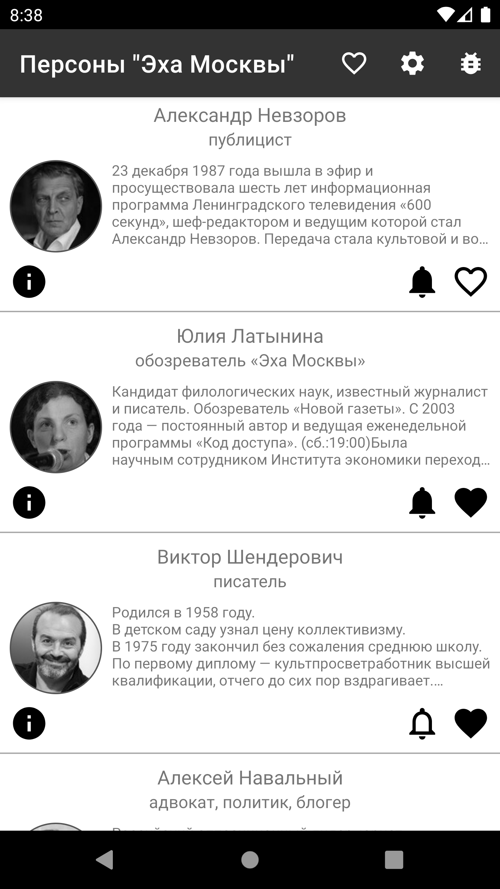
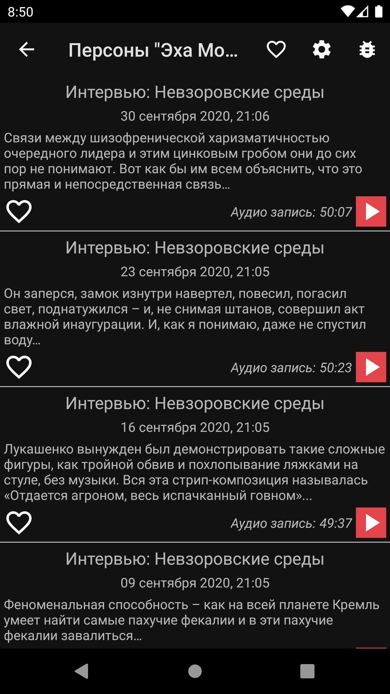
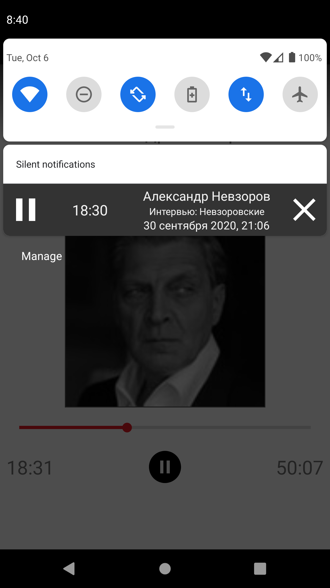
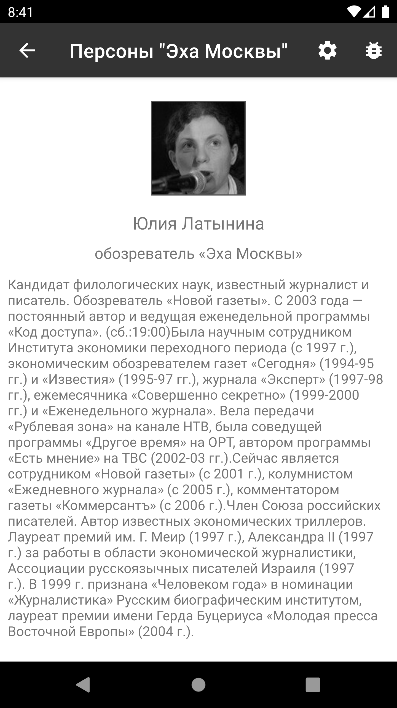

# Persons of "Echo of Moscow"

### Disclaimer
It's a personal "pet" project of Stanislav Sobol (stanislav.i.sobol@gmail.com).
It's forbidden to use for any commercial purpose or to be published as an app on any kind of web resources (e.g. Google Play).
The only goal of the app is to discover Android development process, approaches, technologies and sharpening my personal skills as an Android developer.

### Common notes
The app is a classical app for parsing different web data. It parses data of "Echo of Moscow" radio station web site and extracts
data for using on user's Android based smartphone. The core feature of the app is opportunity to listen to the recorded broadcasts of
famous Russian political and public persons (Nevzorov, Navalny, Latynina e.t.c.).

### Features
- Mediaplayer
- Single activity
- Reach notification (Remote views) for the mediaplayer
- Config files with various parameters
- Offline work. Detects and shows when the device goes offline and back (in the foreground state)
- KAPT for feature routing annotation
- Night mode (dark theme) is widely supported
- Any person who has a personal channel on "Echo of Moscow", can be easily added to the lists of persons via xml-file

### Tech stack

- Android clean arch.
- Dagger 2
- RxJava 2
- Coroutines
- JSoup
- MVVM
- LiveData
- Room
- Glide
- Kapt
- Navigation
- WorkManager
- JUnit (Mockito, PowerMockito)
- Espresso

### Gradle flavors

Gradle flavors are used
- fakeServer - takes data from local assets storage in case if the server is out of reach. Uses LiveData + RxJava 2.
- full - absolute full version of real data. Uses LiveData + RxJava 2.
- espresso - similar to fakeServer flavor. For UI testing. Uses LiveData + RxJava 2.
- fakeServerCoroutines - takes data from local assets storage in case if the server is out of reach.  Uses LiveData + Coroutines.
- fullCoroutines - absolute full version of real data Uses LiveData + Coroutines.
- espressoCoroutines - similar to fakeServerCoroutines flavor. For UI testing Uses LiveData + Coroutines.

### Screenshots

